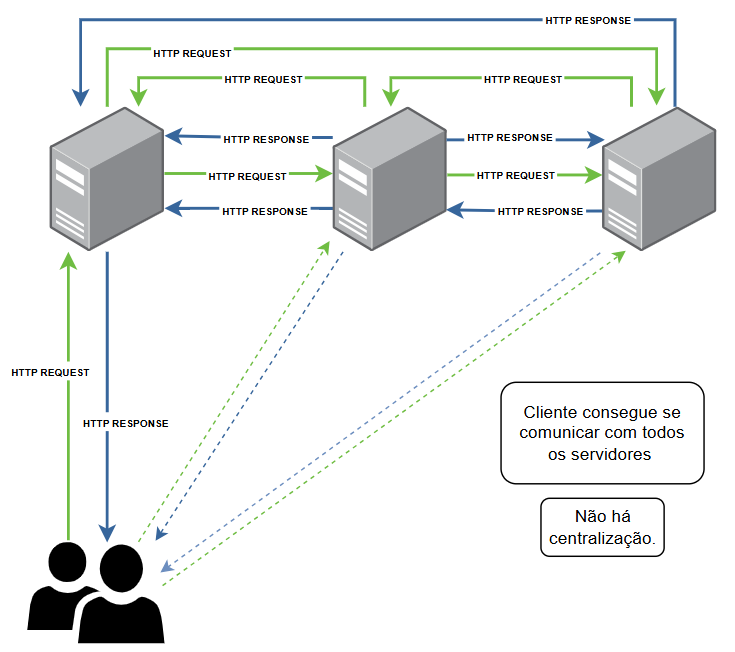

# Problema 2 - Venda de Passagens  

> Grupo:
> - Júlia Carneiro Gonçalves de Souza.
> - Thiago Souza Rodrigues.

Descrição do problema disponível em: [TEC502 - Problema 2 - Venda de Passagens.pdf](https://github.com/julia-carneiro/MI-REDES-2/blob/main/TEC502%20-%20Problema%202%20-%20Venda%20Compartilhada%20de%20Passagens.pdf)

### Introdução
No setor de aviação de baixo custo, ou low-cost carriers (LCC), três companhias aéreas se uniram para criar um sistema compartilhado, onde cada uma pode disponibilizar assentos de seus respectivos voos em uma plataforma unificada. Esse projeto envolve não apenas a interação tradicional entre cliente e servidor, mas também exige comunicação entre os próprios servidores das companhias, dado que todos operam em um ambiente compartilhado.

Para viabilizar essa integração, tanto a comunicação cliente/servidor quanto a comunicação servidor/servidor foram implementadas usando o protocolo HTTP, seguindo os princípios da arquitetura REST. A aplicação foi inteiramente desenvolvida em containers, com todos os servidores e o cliente programados em Go. Cada servidor gerencia suas próprias rotas e coordena com os demais para completar as compras de passagens solicitadas pelos clientes. Do lado do cliente, o sistema permite a busca por rotas desejadas e a finalização da compra dos trechos escolhidos.

### Metodologia

#### Arquitetura da solução
No projeto, foi utilizado o protocolo de API REST para estabelecer uma conexão HTTP entre os servidores, permitindo uma interação não centralizada. Dessa forma, o cliente pode enviar requisições para qualquer servidor, que, por sua vez, se comunicará com os demais para processar as operações solicitadas. Essa arquitetura pode ser classificada como uma arquitetura distribuída com coordenação via 2PC, que é o algoritmo de Commit em Duas Fases (Two-Phase Commit ou 2PC), garantindo consistência transacional em um ambiente de múltiplos servidores. O uso de 2PC assegura a atomicidade das operações, mesmo em um sistema não centralizado.

#### Protocolo de comunicação e Concorrência Distribuída
O foco principal na implementação do sistema foi o gerenciamento de três servidores de maneira a garantir uma aplicação não centralizada. O objetivo principal foi resolver os desafios de concorrência distribuída e condições de corrida, uma vez que, em uma única compra, o cliente pode adquirir trechos de diferentes servidores.

Nesse cenário, é essencial que os servidores se comuniquem adequadamente para efetuar a compra, evitando duplicidade e assegurando que a ordem das solicitações seja respeitada. O diagrama a seguir representa a comunicação entre servidores.

<p align="center">
    
</p>

Para solucionar esse problema foi utilizado o algoritmo 2PC, que é um protocolo de consenso usado em sistemas distribuídos para garantir que uma transação envolvendo múltiplos serviços.

Ele é frequentemente usado em cenários onde várias partes precisam concordar em aplicar uma mudança ou revertê-la, como nesse problema que foi desenvolvido.

### O 2PC ocorre em duas fases principais:
- **Fase de Preparação (Prepare Phase)**:
  - O coordenador (nó central que gerencia o commit) envia uma solicitação de "prepare" a todos os participantes (servidores ou bancos de dados que precisam aplicar a transação).
  - Cada participante realiza todas as operações necessárias e responde ao coordenador com um voto de commit (caso tudo esteja pronto) ou de abort (se houver algum problema).

- **Fase de Commit (Commit Phase)**:
  - Se todos os participantes votarem commit, o coordenador envia um comando de commit final para que todos apliquem a transação.
  - Se algum participante votar abort, o coordenador envia um comando de rollback, revertendo qualquer alteração temporária feita pelos participantes.

Neste projeto, foi desenvolvida uma adaptação do algoritmo 2PC para realizar compras que envolvem mais de um servidor. Inicialmente, um dos três servidores recebe a solicitação de compra do cliente e se torna o servidor coordenador, responsável por comunicar-se com os outros servidores para concluir a transação.

A primeira mensagem enviada pelo servidor coordenador aos demais é uma "PrepareRequest", que contém o ID da transação e os dados da compra. Cada servidor participante possui um vetor onde cada índice corresponde ao ID de um trecho disponível neste servidor. Esse vetor armazena valores booleanos que indicam se o trecho está "reservado" para outro processo no momento.

Se o trecho estiver "reservado" ou não houver vagas disponíveis, o servidor participante retornará "false" ao servidor coordenador. Caso contrário, retornará "true" e armazenará as informações recebidas em um dicionário, utilizando o ID da transação como chave e irá alterar a disponibilidade dos trechos que fazem parte da compra no vetor de trechos reservados. Essa abordagem permite uma coordenação eficaz entre os servidores, garantindo a integridade e a consistência das operações de compra.

Com base nas respostas dos servidores participantes da compra, o servidor coordenador verifica se todos responderam com “true”. Caso algum servidor retorne uma resposta diferente, o coordenador envia uma mensagem para cancelar o commit. Nesse caso, cada servidor participante acessa o vetor de trechos reservados, ajustando o valor para “true”, e remove a transação do dicionário de transações.

Se todos os servidores retornarem “true”, o coordenador envia uma mensagem de confirmação, e os servidores participantes repetem o processo de ajuste no vetor de trechos reservados e no dicionário de transações. Em seguida, realizam a etapa de finalização da compra, que consiste em reduzir o número de vagas disponíveis nos trechos envolvidos e salvar as alterações.

É importante notar que a mensagem de preparação não é enviada para todos os servidores ao mesmo tempo. Ela segue a ordem dos servidores em um vetor de participantes, que é parte dos parâmetros da compra. Durante o envio da mensagem de preparação, o servidor coordenador tenta contatar cada participante até 10 vezes; se, em todas as tentativas, o servidor participante retornar “false”, o coordenador aborta o processo e envia uma mensagem de cancelamento do commit, caso algum servidor já tenha se preparado para ele.

### Discussão e Resultados
A implementação do sistema de reserva de passagens aéreas entre três companhias de baixo custo demonstrou a viabilidade do uso do protocolo de Commit em Duas Fases (2PC) para garantir a consistência transacional em um ambiente distribuído. Através da arquitetura REST, foi possível estabelecer uma comunicação eficaz entre os servidores, permitindo que o cliente interagisse com qualquer um deles sem comprometer a integridade dos dados.

A implementação da fase de preparação garantiu que todos os servidores participantes pudessem avaliar a disponibilidade dos trechos de forma independente antes da confirmação final. Isso não apenas evitou a duplicidade de reservas, mas também assegurou que as respostas dos servidores fossem respeitadas, proporcionando um fluxo de trabalho sem erros. Além disso, o controle de tentativas de comunicação, com até 10 tentativas para cada mensagem de preparação, foi indispensável no momento de lidar com eventuais falhas de rede ou indisponibilidade temporária de servidores.

Para assegurar a eficácia do sistema desenvolvido, foram criados testes específicos para avaliar sua eficiência. Esses testes simulam múltiplas tentativas de compra simultâneas, com um número de solicitações superior ao de vagas disponíveis nos trechos. Para tornar os testes ainda mais rigorosos, as solicitações foram organizadas em três grupos distintos, onde cada grupo envia as requisições para servidores diferentes. Essa estrutura garante que, mesmo em um sistema distribuído, os servidores consigam se comunicar e coordenar as compras de forma correta entre si.

### Conclusão
Em suma, a implementação do sistema de reservas entre as companhias aéreas de baixo custo demonstrou a eficácia da arquitetura distribuída aliada ao protocolo de Commit em Duas Fases (2PC). Essa abordagem garantiu a consistência transacional em um ambiente de múltiplos servidores e possibilitou uma interação fluida entre clientes e servidores, proporcionando uma experiência de compra confiável.

As lições aprendidas ao longo deste projeto indicam que, embora o sistema atenda às necessidades atuais, há espaço para melhorias, especialmente em relação à latência e ao tratamento de falhas. Futuras implementações podem considerar o uso de abordagens mais avançadas para otimizar o desempenho.

### Executar

1. **Crie uma rede Docker**
   
   A rede será utilizada para conectar todos os contêineres.

   ```bash
   docker network create rede
   ```

2. **Build dos Contêineres**

   Compile as imagens Docker para os três servidores e o contêiner de teste.

   ```bash
   docker build -t server1 .
   docker build -t server2 .
   docker build -t server3 .
   docker build -t teste .
   ```

3. **Iniciar os Contêineres dos Servidores**

   Execute cada servidor em um contêiner separado, associando cada um à rede `rede` e mapeando as portas conforme necessário. Além disso, monte o volume `dados` para cada contêiner para compartilhar dados entre o sistema de arquivos local e os contêineres.

   ```bash
   docker run -d --name server1 --network rede -p 8000:8000 -v ${PWD}/dados:/app/dados server1
   docker run -d --name server2 --network rede -p 8001:8001 -v ${PWD}/dados:/app/dados server2
   docker run -d --name server3 --network rede -p 8002:8002 -v ${PWD}/dados:/app/dados server3
   ```
   
   - `--network rede`: Conecta os contêineres à rede `rede`.
   - `-p <host_port>:<container_port>`: Mapeia as portas entre o host e o contêiner.
   - `-v ${PWD}/dados:/app/dados`: Monta o diretório `dados` do host no contêiner.

4. **Iniciar o Contêiner de Teste**

   Execute o contêiner `teste` interativamente, permitindo a interação direta com os servidores.

   ```bash
   docker run -it --rm --name teste --network rede teste
   ```

   - `--network rede`: Conecta o contêiner `teste` à mesma rede que os servidores.

### Observação

Certifique-se de que o diretório `dados` exista no diretório atual antes de iniciar os contêineres. Ele será montado em cada contêiner para armazenar dados persistentes.
### Referências
- O que é uma API de REST? | IBM. Disponível em: <https://www.ibm.com/br-pt/topics/rest-apis>.
- TO, C. Two-phase commit protocol. Disponível em: <https://concursos.fandom.com/wiki/Two-phase_commit_protocol>. Acesso em: 1 nov. 2024.
- GONÇALVES, M. M. Concorrência e Tolerância a Falhas em Sistemas Distribuídos. Disponível em: <https://medium.com/@marcelomg21/concorr%C3%AAncia-e-toler%C3%A2ncia-a-falhas-em-sistemas-distribu%C3%ADdos-5952c6836146>.
- ACIOLY, R. Construindo uma API RESTful com GO - Rafael Acioly - Medium. Disponível em: <https://medium.com/@rafaelacioly/construindo-uma-api-restful-com-go-d6007e4faff6>. Acesso em: 1 nov. 2024.
